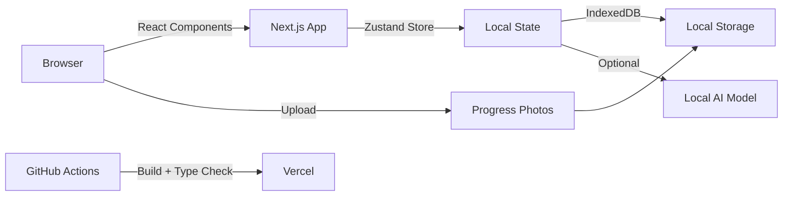

# Planter

> Local first AI botanical journal. Track plants, photos, and care notes with offline intelligence.

## Demo

Live: **[planter-ekb2f1y8p-michael-preciados-projects.vercel.app](https://planter-ekb2f1y8p-michael-preciados-projects.vercel.app)**

## Why I built this

Plant care gets scattered across memory, camera rolls, and notes apps. I wanted a single place where each plant becomes a living project: profile, history, progress photos, and eventually local AI guidance. Built to demonstrate product judgment, not demo hype.

## Features

- Local first plant records stored in the browser
- Progress photo tracking with before/after comparison
- Health scoring and attention badges
- Export/import backups for data ownership
- Mobile first responsive design
- AI ready architecture for future offline models

## Architecture



## Quickstart

```bash
git clone https://github.com/michaelpreciado/Planter.git
cd Planter
npm install       # or pnpm install
npm run dev        # Start dev server
# Open http://localhost:3000
```

## Tech Stack


## Project Structure

```
src/
├── app/              # Next.js App Router pages
├── components/       # Reusable React components
├── lib/             # Zustand stores and utilities
├── types/           # TypeScript definitions
├── hooks/           # Custom React hooks
└── contexts/        # React contexts
```

## Development

```bash
npm run type-check    # TypeScript validation
npm run build         # Production build
npm run lint          # ESLint checks
```

## Roadmap

- [ ] Screenshot/GIF demo in README
- [ ] Rich plant timeline and note filtering
- [ ] Local offline AI model integration (Gemma 4B)
- [ ] Accessibility and keyboard navigation
- [ ] Optional cloud sync without losing local-first ownership

## Lessons learned

- **PWA offline-first patterns**: Service workers add complexity; start with local storage and add sync later
- **Supabase RLS for image storage**: Row Level Security is powerful but easy to misconfigure; test with anon keys
- **Capacitor for iOS wrapping**: Native shell adds build friction; evaluate if web-first is sufficient before wrapping
- **Scope reduction**: Removing legacy auth, sync, and mobile-shell code made the core experience faster and easier to maintain

## License

MIT License

---

**Built by Michael Preciado** — [Preciado Tech](https://preciado.tech) · [X @preciadotech](https://x.com/preciadotech)
